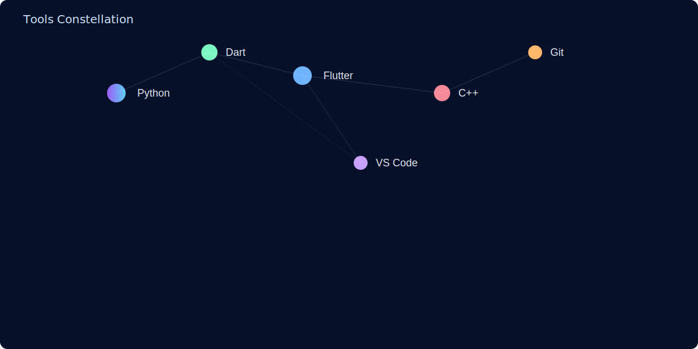

<!-- Cosmic Banner -->

  

<h1 align="center">🌌 CosmosByME</h1>

<strong>Exploring the universe — one line of code at a time.</strong>

---

<!-- Typing Intro -->

  

---

## 🌠 About Me
- 🌌 Passionate about programming & astronomy  
- 💻 Currently learning: Python, Dart, C++, Flutter  
- 🔭 Interested in mobile dev, algorithms, and backend basics  
- 🚀 Building small projects to improve fundamentals  
- 🛠 Love writing clean, simple, readable code  

---

## 🌌 Currently Working On
<!-- START_SECTION:currently -->
_Updating… the workflow will replace this block with your latest repo and commit info._
<!-- END_SECTION:currently -->

---

## 🪐 Skill Nebula

  

---

## ✨ Tools Constellation  

  

---

## 🚀 Featured Repositories
> *(Insert or edit your own repository links below — I left placeholders for you.)*

### 🌀 Python
- [python-basics](#)  
- [python-mini-projects](#)

### 🌙 Dart & Flutter
- [dart-practice](#)  
- [flutter-experiments](#)

### ☀️ C++
- [cpp-basics](#)  
- [cpp-algorithms](#)

---

## 🐍 Contribution Snake
> To enable the animated snake that "eats" your contribution graph, see the workflow instructions below (I provided guidance). If you enable it, the generated image will be placed at `output/github-contribution-grid-snake.svg` and you can reference it here.

  <!-- If you later enable the snake generator, it will be safe to replace the `src` below with the generated path -->
  

---

## 📊 GitHub Stats

  
  

  

---

## 🌌 3D Contribution Galaxy (Optional)
> (If you enable the 3D contribution generator workflow, place the generated image under `profile-3d-contrib/` and update the image path below.)

  

---

## ⭐ Stars Observed So Far

  

---

## 🌠 Space Quote of the Day

<i id="quote">"Updating..."</i>

---

  

